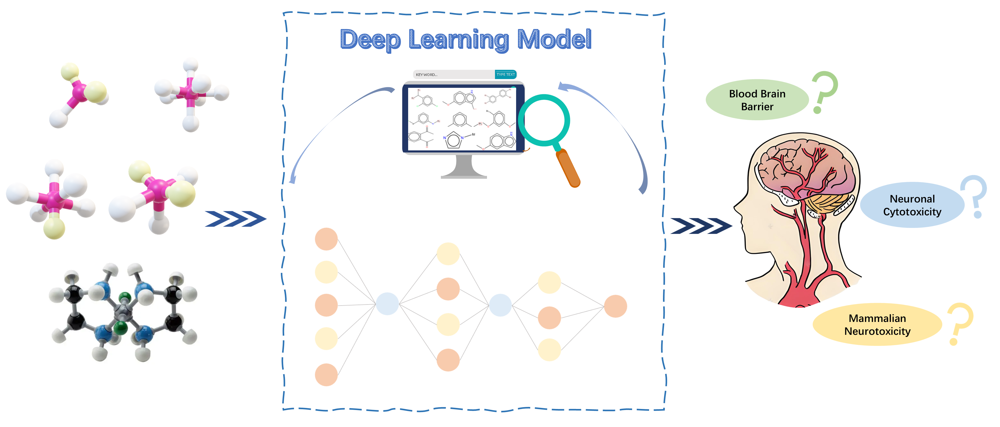

# 🧠 **NeuroTDPi: Deep Neural Network for Multimodal Neurotoxicity Prediction**

We developed a multilayer fully connected deep neural network model, designated **NeuroTDPi**, using multimodal fusion of molecular characterization with representations targeting of three neurotoxicity endpoints, including:

1. **Blood-Brain Barrier (BBB) Permeability**
2. **Neuronal Cytotoxicity (NC)**
3. **Mammalian Neurotoxicity (NT)**

  
   
  <em>Figure 1: Schematic overview of the NeuroTDPi framework</em>

## 📁 **Project Structure**
